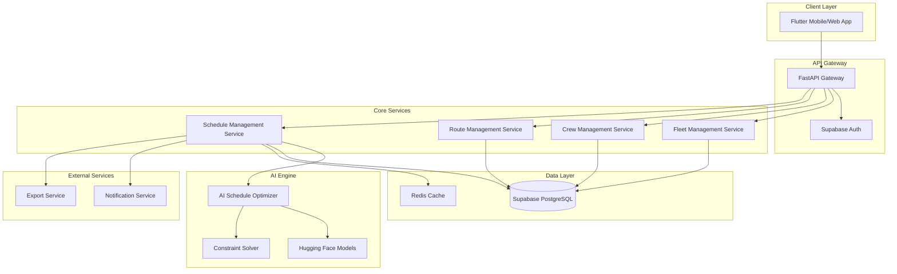
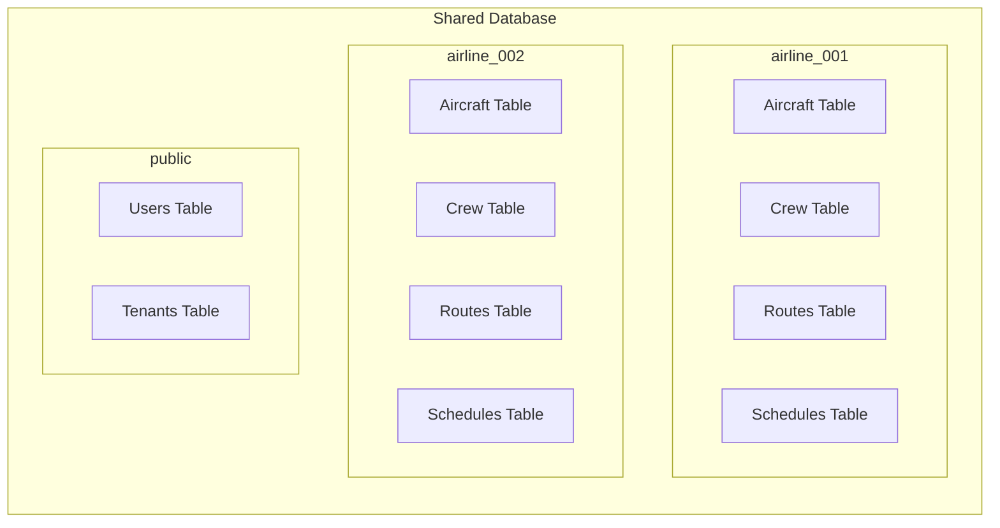
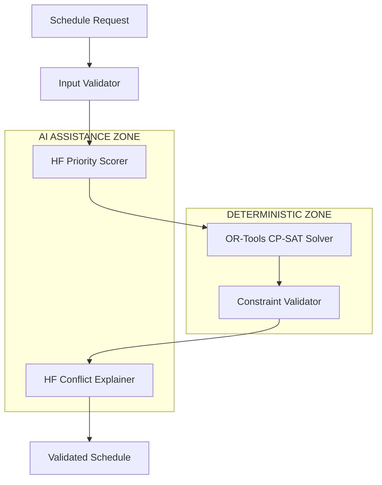

# Design Document: SkyOpsHub

## Overview

SkyOpsHub is a multi-tenant SaaS platform that leverages AI-powered optimization to solve complex airline scheduling problems. The system combines traditional constraint satisfaction techniques with modern machine learning approaches to generate optimal flight schedules while respecting aviation regulations, crew duty cycles, and operational constraints.

The platform follows a microservices architecture built on Python/FastAPI for the backend, with Supabase providing authentication and PostgreSQL database services. The AI scheduling engine utilizes reinforcement learning models and constraint programming to optimize resource allocation across multiple dimensions: aircraft utilization, crew assignments, route coverage, and regulatory compliance.

Key architectural principles include strict tenant isolation, scalable AI processing, and real-time schedule optimization with manual override capabilities.

## Architecture

### High-Level System Architecture



### Multi-Tenant Architecture Pattern

The system implements **schema-based multi-tenancy** where each airline tenant has its own database schema within the shared PostgreSQL instance. This approach provides:

- **Strong data isolation**: Each tenant's data is physically separated at the schema level
- **Cost efficiency**: Shared infrastructure while maintaining isolation
- **Simplified backup/restore**: Per-tenant schema operations
- **Performance optimization**: Tenant-specific indexing strategies



## AI Scheduling Authority & Constraint Model (MANDATORY)

**CRITICAL: The scheduling system is a HYBRID system with clear authority boundaries.**

### Authority Hierarchy (NON-NEGOTIABLE)

#### Constraint Solver: AUTHORITATIVE for All Hard Constraints
- **Technology**: OR-Tools CP-SAT or MILP solver
- **Authority**: FINAL DECISION MAKER for all legal, safety, and regulatory constraints
- **Cannot Be Overridden By**: Any ML model, LLM output, or human preference
- **Enforces**:
  - FAA/EASA crew duty time regulations (legally binding)
  - Mandatory rest periods between flights (safety critical)
  - Aircraft maintenance windows (regulatory compliance)
  - Crew qualification requirements (safety critical)
  - Airport slot restrictions (operational constraints)
  - Aircraft range and fuel limitations (physical constraints)

#### Hugging Face Models: ADVISORY ONLY
- **Authority**: ZERO authority over hard constraints
- **Role**: Optimization assistance and explanation generation
- **Permitted Uses**:
  - Priority scoring for route preferences (soft optimization)
  - Conflict explanation generation for human understanding
  - Optimization suggestion ranking (non-binding recommendations)
  - What-if scenario analysis (exploratory only)
  - Historical pattern recognition (informational)

### Why Pure ML/LLMs Are Unsafe for Airline Scheduling

**Legal Liability**: ML models cannot guarantee 100% compliance with aviation regulations
**Safety Risk**: Probabilistic decisions are unacceptable for crew duty limits and maintenance windows
**Regulatory Compliance**: Aviation authorities require deterministic constraint satisfaction
**Audit Trail**: ML decisions are not explainable for regulatory audits
**Liability**: Airlines face legal consequences for regulation violations

### AI Authority Rules (ENFORCED)

#### What AI CAN Do
- Suggest route priorities based on historical data
- Generate human-readable explanations for constraint violations
- Rank optimization alternatives for human review
- Provide what-if analysis for planning scenarios
- Identify patterns in historical scheduling data

#### What AI CANNOT Do (PROHIBITED)
- Override any hard constraint decision
- Make final assignments that violate regulations
- Determine crew duty compliance (constraint solver only)
- Approve maintenance window conflicts
- Make safety-critical scheduling decisions

### Constraint Solver Output is Authoritative
- **Final Authority**: Only the constraint solver output determines schedule feasibility
- **No Overrides**: ML models cannot modify constraint solver decisions
- **Validation**: All schedules must pass deterministic constraint validation
- **Audit Trail**: All constraint decisions must be traceable to deterministic logic

### AI Scheduling Architecture - HYBRID SYSTEM (CRITICAL)

**WARNING: Pure ML models are UNSAFE for airline scheduling due to hard regulatory constraints.**

The AI scheduling engine uses a **HYBRID ARCHITECTURE** with clear separation of concerns:

#### Primary Engine: Constraint Programming (DETERMINISTIC)
- **Technology**: OR-Tools CP-SAT or MILP solver
- **Responsibility**: ALL hard constraints and legal requirements
- **Handles**:
  - Crew duty time limits (FAA/EASA regulations)
  - Mandatory rest periods between flights
  - Aircraft maintenance windows (legally required)
  - Crew qualification matching (safety critical)
  - Airport slot restrictions
  - Aircraft range and fuel limitations

#### Secondary Engine: Hugging Face Models (NON-DETERMINISTIC)
- **Technology**: Classification, ranking, and language models ONLY
- **Responsibility**: Optimization hints and explanations
- **Allowed Uses**:
  - Priority scoring for route preferences
  - Conflict explanation generation (LLM)
  - Optimization suggestion ranking
  - What-if scenario analysis
  - Historical pattern recognition

#### Prohibited AI Uses
- **NEVER** use ML models for:
  - Hard constraint satisfaction
  - Legal compliance decisions
  - Safety-critical assignments
  - Final schedule validation

#### Architecture Flow


#### Recommended Hugging Face Models
- **Priority Scoring**: `sentence-transformers/all-MiniLM-L6-v2` for route similarity
- **Conflict Explanation**: `microsoft/DialoGPT-medium` for natural language explanations
- **Pattern Recognition**: `facebook/bart-base` for historical analysis

#### Deterministic vs Non-Deterministic Rules
- **Deterministic Required**: All constraint satisfaction, legal compliance, safety decisions
- **Non-Deterministic Allowed**: Priority scoring, explanations, suggestions, analytics

## Flutter Application Architecture & Engineering Rules (CRITICAL)

### State Management: Bloc Pattern (NON-NEGOTIABLE)
- **Required Technology**: `flutter_bloc` package version 8.0+
- **Prohibited Alternatives**: Provider, Riverpod, GetX, setState, or any other state management
- **Reason**: Predictable state transitions, testability, separation of concerns
- **Pattern Enforcement**: All state changes MUST go through BlocEvents and BlocStates

### Feature-Based Folder Structure (MANDATORY)
```
lib/
├── main.dart
├── app/
│   ├── app.dart                    # Root app widget
│   ├── routes.dart                 # App routing configuration
│   └── theme.dart                  # App theme configuration
├── core/
│   ├── api/
│   │   ├── api_client.dart         # HTTP client with tenant/auth injection
│   │   ├── auth_interceptor.dart   # JWT token management
│   │   ├── tenant_interceptor.dart # Automatic tenant header injection
│   │   └── api_exceptions.dart     # Standardized API error handling
│   ├── constants/
│   │   ├── api_constants.dart      # API endpoints and configuration
│   │   ├── app_constants.dart      # App-wide constants
│   │   └── storage_keys.dart       # Secure storage key constants
│   ├── utils/
│   │   ├── date_utils.dart         # Date/time utilities for scheduling
│   │   ├── validation_utils.dart   # Input validation helpers
│   │   └── format_utils.dart       # Data formatting utilities
│   └── theme/
│       ├── app_colors.dart         # Color scheme
│       ├── app_text_styles.dart    # Typography
│       └── app_dimensions.dart     # Spacing and sizing
├── features/
│   ├── auth/
│   │   ├── data/
│   │   │   ├── models/             # Auth data models
│   │   │   ├── repositories/       # Auth API calls
│   │   │   └── datasources/        # Local/remote data sources
│   │   ├── domain/
│   │   │   ├── entities/           # Auth business entities
│   │   │   ├── repositories/       # Abstract repositories
│   │   │   └── usecases/           # Auth business logic
│   │   └── presentation/
│   │       ├── bloc/               # AuthBloc, AuthEvent, AuthState
│   │       ├── pages/              # Login, logout pages
│   │       └── widgets/            # Auth-specific widgets
│   ├── fleet/
│   │   ├── data/
│   │   ├── domain/
│   │   └── presentation/
│   ├── crew/
│   │   ├── data/
│   │   ├── domain/
│   │   └── presentation/
│   ├── routes/
│   │   ├── data/
│   │   ├── domain/
│   │   └── presentation/
│   ├── schedules/
│   │   ├── data/
│   │   ├── domain/
│   │   └── presentation/
│   └── dashboard/
│       ├── data/
│       ├── domain/
│       └── presentation/
└── shared/
    ├── widgets/
    │   ├── loading_widgets.dart    # Standardized loading indicators
    │   ├── error_widgets.dart      # Standardized error displays
    │   ├── calendar_widgets.dart   # Schedule calendar components
    │   └── form_widgets.dart       # Reusable form components
    ├── models/
    │   ├── api_response.dart       # Standardized API response wrapper
    │   ├── pagination.dart         # Pagination models
    │   └── job_status.dart         # Job status models
    └── utils/
        ├── extensions.dart         # Dart extensions
        ├── validators.dart         # Form validation
        └── helpers.dart            # General utilities
```

### API Client Abstraction Layer (MANDATORY)
```dart
// REQUIRED: Tenant-aware API client with automatic context injection
abstract class ApiClient {
  Future<ApiResponse<T>> get<T>(String endpoint, {Map<String, dynamic>? queryParams});
  Future<ApiResponse<T>> post<T>(String endpoint, {dynamic body});
  Future<ApiResponse<T>> put<T>(String endpoint, {dynamic body});
  Future<ApiResponse<T>> delete<T>(String endpoint);
}

class ApiClientImpl implements ApiClient {
  final Dio _dio;
  final AuthRepository _authRepository;
  final String _baseUrl;
  
  ApiClientImpl(this._dio, this._authRepository, this._baseUrl) {
    _dio.interceptors.addAll([
      AuthInterceptor(_authRepository),      // JWT token injection
      TenantInterceptor(_authRepository),    // airline_id header injection
      LoggingInterceptor(),                  // Request/response logging
      ErrorInterceptor(),                    // Standardized error handling
    ]);
  }
  
  // ALL API calls automatically include:
  // - Authorization: Bearer <jwt_token>
  // - X-Airline-ID: <airline_id>
  // - Content-Type: application/json
}
```

### Secure Auth Token Storage (REQUIRED)
```dart
// REQUIRED: Secure token storage using flutter_secure_storage
class SecureTokenStorage {
  static const _storage = FlutterSecureStorage(
    aOptions: AndroidOptions(
      encryptedSharedPreferences: true,
    ),
    iOptions: IOSOptions(
      accessibility: IOSAccessibility.first_unlock_this_device,
    ),
  );
  
  static const String _accessTokenKey = 'access_token';
  static const String _refreshTokenKey = 'refresh_token';
  static const String _userDataKey = 'user_data';
  
  // NEVER store tokens in SharedPreferences or regular storage
}
```

### Role-Based Navigation (ENFORCED)
```dart
// REQUIRED: Role-based route guards and navigation restrictions
class AppRouter {
  static final GoRouter router = GoRouter(
    routes: [
      GoRoute(
        path: '/dashboard',
        builder: (context, state) => const DashboardPage(),
        redirect: (context, state) => _checkAccess('/dashboard', context),
      ),
      GoRoute(
        path: '/fleet',
        builder: (context, state) => const FleetPage(),
        redirect: (context, state) => _checkAccess('/fleet', context),
      ),
      GoRoute(
        path: '/platform-admin',
        builder: (context, state) => const PlatformAdminPage(),
        redirect: (context, state) => _checkAccess('/platform-admin', context),
      ),
    ],
  );
  
  static String? _checkAccess(String route, BuildContext context) {
    final authState = context.read<AuthBloc>().state;
    if (authState is! AuthAuthenticated) return '/login';
    
    final userRole = authState.user.role;
    
    // Platform super admin: access to all routes
    if (userRole == UserRole.platformSuperAdmin) return null;
    
    // Airline admin: no access to platform routes
    if (route.startsWith('/platform') && userRole != UserRole.platformSuperAdmin) {
      return '/unauthorized';
    }
    
    // Airline user: read-only access only
    if (userRole == UserRole.airlineUser && _isWriteRoute(route)) {
      return '/unauthorized';
    }
    
    return null; // Access granted
  }
}
```

### Long-Running Scheduling Jobs Handling (REQUIRED)
```dart
// REQUIRED: Job status polling with automatic UI updates
class ScheduleGenerationBloc extends Bloc<ScheduleEvent, ScheduleState> {
  final ScheduleRepository _repository;
  Timer? _pollingTimer;
  
  ScheduleGenerationBloc(this._repository) : super(ScheduleInitial()) {
    on<StartScheduleGeneration>(_onStartGeneration);
    on<CheckJobStatus>(_onCheckJobStatus);
    on<CancelScheduleGeneration>(_onCancelGeneration);
  }
  
  Future<void> _onStartGeneration(StartScheduleGeneration event, Emitter<ScheduleState> emit) async {
    try {
      emit(ScheduleGenerating(progress: 0, message: "Starting generation..."));
      
      final job = await _repository.startScheduleGeneration(event.request);
      
      // Start polling job status every 2 seconds
      _startJobPolling(job.id);
      
    } catch (e) {
      emit(ScheduleError(message: e.toString(), isRetryable: true));
    }
  }
  
  void _startJobPolling(String jobId) {
    _pollingTimer?.cancel();
    _pollingTimer = Timer.periodic(const Duration(seconds: 2), (_) {
      add(CheckJobStatus(jobId));
    });
  }
  
  Future<void> _onCheckJobStatus(CheckJobStatus event, Emitter<ScheduleState> emit) async {
    try {
      final jobStatus = await _repository.getJobStatus(event.jobId);
      
      switch (jobStatus.status) {
        case JobStatus.running:
          emit(ScheduleGenerating(
            progress: jobStatus.progressPercent,
            message: jobStatus.statusMessage,
          ));
          break;
        case JobStatus.completed:
          _stopPolling();
          final schedule = await _repository.getSchedule(jobStatus.scheduleId!);
          emit(ScheduleGenerated(schedule: schedule));
          break;
        case JobStatus.failed:
          _stopPolling();
          emit(ScheduleError(
            message: jobStatus.errorMessage ?? "Generation failed",
            isRetryable: true,
          ));
          break;
        case JobStatus.partial:
          _stopPolling();
          final partialSchedule = await _repository.getSchedule(jobStatus.scheduleId!);
          emit(SchedulePartiallyGenerated(
            schedule: partialSchedule,
            conflicts: jobStatus.conflicts ?? [],
          ));
          break;
      }
    } catch (e) {
      emit(ScheduleError(message: e.toString(), isRetryable: true));
    }
  }
  
  void _stopPolling() {
    _pollingTimer?.cancel();
    _pollingTimer = null;
  }
  
  @override
  Future<void> close() {
    _stopPolling();
    return super.close();
  }
}
```

### Loading & Progress States (MANDATORY)
```dart
// REQUIRED: Standardized loading and progress state handling
abstract class ScheduleState extends Equatable {
  const ScheduleState();
}

class ScheduleInitial extends ScheduleState {
  @override
  List<Object> get props => [];
}

class ScheduleLoading extends ScheduleState {
  @override
  List<Object> get props => [];
}

class ScheduleGenerating extends ScheduleState {
  final int progress;           // 0-100
  final String message;         // "Loading fleet data...", "Running optimizer..."
  final bool canCancel;         // Whether user can cancel
  
  const ScheduleGenerating({
    required this.progress,
    required this.message,
    this.canCancel = true,
  });
  
  @override
  List<Object> get props => [progress, message, canCancel];
}

class ScheduleLoaded extends ScheduleState {
  final List<Schedule> schedules;
  
  const ScheduleLoaded({required this.schedules});
  
  @override
  List<Object> get props => [schedules];
}

class ScheduleGenerated extends ScheduleState {
  final Schedule schedule;
  final OptimizationMetrics metrics;
  
  const ScheduleGenerated({required this.schedule, required this.metrics});
  
  @override
  List<Object> get props => [schedule, metrics];
}
```

### Error & Retry States (MANDATORY)
```dart
// REQUIRED: Comprehensive error handling with retry capabilities
class ScheduleError extends ScheduleState {
  final String message;
  final bool isRetryable;
  final String? errorCode;
  final Map<String, dynamic>? errorDetails;
  
  const ScheduleError({
    required this.message,
    required this.isRetryable,
    this.errorCode,
    this.errorDetails,
  });
  
  @override
  List<Object?> get props => [message, isRetryable, errorCode, errorDetails];
}

class SchedulePartiallyGenerated extends ScheduleState {
  final Schedule schedule;
  final List<ScheduleConflict> conflicts;
  final String message;
  
  const SchedulePartiallyGenerated({
    required this.schedule,
    required this.conflicts,
    required this.message,
  });
  
  @override
  List<Object> get props => [schedule, conflicts, message];
}

// REQUIRED: Error widget with retry functionality
class ErrorWidget extends StatelessWidget {
  final String message;
  final bool isRetryable;
  final VoidCallback? onRetry;
  
  const ErrorWidget({
    Key? key,
    required this.message,
    required this.isRetryable,
    this.onRetry,
  }) : super(key: key);
  
  @override
  Widget build(BuildContext context) {
    return Column(
      mainAxisAlignment: MainAxisAlignment.center,
      children: [
        Icon(Icons.error_outline, size: 64, color: Colors.red),
        SizedBox(height: 16),
        Text(message, textAlign: TextAlign.center),
        if (isRetryable && onRetry != null) ...[
          SizedBox(height: 16),
          ElevatedButton(
            onPressed: onRetry,
            child: Text('Retry'),
          ),
        ],
      ],
    );
  }
}
```

### Schedule Regeneration Flows (REQUIRED)
```dart
// REQUIRED: Handle schedule regeneration with conflict resolution
class ScheduleRegenerationBloc extends Bloc<ScheduleRegenerationEvent, ScheduleRegenerationState> {
  Future<void> _onRegenerateWithChanges(
    RegenerateWithChanges event,
    Emitter<ScheduleRegenerationState> emit,
  ) async {
    emit(ScheduleRegenerationLoading());
    
    try {
      // Validate manual changes don't violate hard constraints
      final validationResult = await _repository.validateManualChanges(event.changes);
      
      if (validationResult.hasViolations) {
        emit(ScheduleRegenerationConflict(
          conflicts: validationResult.violations,
          suggestedResolutions: validationResult.suggestions,
        ));
        return;
      }
      
      // Lock manual changes and regenerate
      final job = await _repository.regenerateWithLockedChanges(
        scheduleId: event.scheduleId,
        lockedChanges: event.changes,
      );
      
      // Start polling for regeneration progress
      _startRegenerationPolling(job.id);
      
    } catch (e) {
      emit(ScheduleRegenerationError(message: e.toString()));
    }
  }
}
```

## Flutter Frontend Architecture (MANDATORY)

### State Management: Bloc Pattern (REQUIRED)
- **Technology**: `flutter_bloc` package
- **Reason**: Predictable state, testable, separation of concerns
- **NO** ad-hoc state management patterns allowed

### Folder Structure (NON-NEGOTIABLE)
```
frontend/
├── lib/
│   ├── main.dart
│   ├── app/
│   │   ├── app.dart           # App widget
│   │   └── routes.dart        # Navigation
│   ├── core/
│   │   ├── api/
│   │   │   ├── api_client.dart     # HTTP client
│   │   │   ├── auth_interceptor.dart
│   │   │   └── tenant_interceptor.dart
│   │   ├── constants/
│   │   ├── utils/
│   │   └── theme/
│   ├── features/              # Feature-based organization
│   │   ├── auth/
│   │   │   ├── data/          # API calls, models
│   │   │   ├── domain/        # Business logic
│   │   │   ├── presentation/  # UI, Bloc, pages
│   │   ├── fleet/
│   │   ├── crew/
│   │   ├── routes/
│   │   ├── schedules/
│   │   └── dashboard/
│   └── shared/
│       ├── widgets/
│       ├── models/
│       └── utils/
```

### Role-Based Navigation (ENFORCED)
```dart
// REQUIRED: Role-based route guards
class RouteGuard {
  static bool canAccess(String route, UserRole role) {
    switch (role) {
      case UserRole.platformSuperAdmin:
        return true; // All routes
      case UserRole.airlineAdmin:
        return !route.startsWith('/platform/');
      case UserRole.airlineUser:
        return _readOnlyRoutes.contains(route);
    }
  }
}
```

### API Client Pattern (MANDATORY)
```dart
// REQUIRED: Tenant-aware API client
class ApiClient {
  final String baseUrl;
  final String tenantId;
  final AuthInterceptor authInterceptor;
  final TenantInterceptor tenantInterceptor;
  
  // ALL API calls MUST include tenant context
  Future<T> get<T>(String endpoint) async {
    // Auto-inject tenant ID and auth headers
  }
}
```

### Long-Running Job Handling (REQUIRED)
```dart
// REQUIRED: Job status polling
class ScheduleGenerationBloc extends Bloc<ScheduleEvent, ScheduleState> {
  Timer? _pollingTimer;
  
  void _startJobPolling(String jobId) {
    _pollingTimer = Timer.periodic(Duration(seconds: 2), (timer) {
      add(CheckJobStatus(jobId));
    });
  }
  
  void _handleJobComplete() {
    _pollingTimer?.cancel();
    // Update UI with results
  }
}
```

### Calendar/Schedule UI Strategy
- **Technology**: `table_calendar` for calendar views
- **Custom**: Timeline widget for aircraft/crew utilization
- **Required**: Offline-first caching for schedule data
- **Required**: Optimistic updates for manual changes

### Error Handling Patterns (MANDATORY)
```dart
// REQUIRED: Standardized error states
abstract class ScheduleState {
  const ScheduleState();
}

class ScheduleLoading extends ScheduleState {}
class ScheduleLoaded extends ScheduleState {
  final List<Schedule> schedules;
}
class ScheduleError extends ScheduleState {
  final String message;
  final bool isRetryable;
}
class SchedulePartialFailure extends ScheduleState {
  final List<Schedule> partialData;
  final String errorMessage;
}
```

## Mandatory Backend Architecture

### Folder Structure (NON-NEGOTIABLE)
```
backend/
├── app/
│   ├── main.py                 # FastAPI app entry point
│   ├── core/
│   │   ├── config.py          # Environment configuration
│   │   ├── security.py        # JWT/Auth utilities
│   │   └── database.py        # Supabase connection
│   ├── api/
│   │   ├── v1/
│   │   │   ├── routers/        # API endpoints ONLY
│   │   │   │   ├── aircraft.py
│   │   │   │   ├── crew.py
│   │   │   │   ├── routes.py
│   │   │   │   ├── schedules.py
│   │   │   │   └── jobs.py
│   │   │   └── dependencies.py # Auth/tenant injection
│   ├── services/              # Business logic ONLY
│   │   ├── fleet_service.py
│   │   ├── crew_service.py
│   │   ├── route_service.py
│   │   └── schedule_service.py
│   ├── domain/                # Data models
│   │   ├── models/
│   │   ├── schemas/           # Pydantic models
│   │   └── enums.py
│   ├── scheduling/            # AI engine (isolated)
│   │   ├── constraint_solver.py
│   │   ├── ai_scorer.py
│   │   ├── optimizer.py
│   │   └── validators.py
│   ├── jobs/                  # Background tasks
│   │   ├── scheduler.py       # Celery/RQ setup
│   │   ├── schedule_jobs.py
│   │   └── notification_jobs.py
│   └── middleware/
│       ├── auth.py
│       ├── tenant.py
│       └── rate_limit.py
```

### Responsibility Boundaries (ENFORCED)

#### API Routers (app/api/v1/routers/)
- **ONLY** handle HTTP requests/responses
- **ONLY** call service layer methods
- **NO** business logic
- **NO** direct database access
- **NO** AI/scheduling logic

#### Services (app/services/)
- **ALL** business logic
- **ALL** data validation
- **ALL** cross-entity operations
- **NO** HTTP concerns
- **NO** direct AI calls (use scheduling module)

#### Scheduling Module (app/scheduling/)
- **ISOLATED** from HTTP layer
- **ALL** AI and constraint solving
- **DETERMINISTIC** constraint validation
- **NON-DETERMINISTIC** AI assistance

#### Jobs Module (app/jobs/)
- **ALL** long-running operations
- **ALL** background processing
- **NO** synchronous API calls

### Async Job Requirements (MANDATORY)

#### Schedule Generation MUST Be Async
```python
# CORRECT: Async job pattern
@router.post("/schedules/generate")
async def generate_schedule(request: ScheduleRequest):
    job = await schedule_service.start_generation_job(request)
    return {"job_id": job.id, "status": "queued"}

# WRONG: Synchronous generation
@router.post("/schedules/generate")  
async def generate_schedule(request: ScheduleRequest):
    schedule = await ai_optimizer.generate(request)  # FORBIDDEN
    return schedule
```

#### Job Status Storage
- Store in database with tenant isolation
- Include progress percentage, error messages, partial results
- Support cancellation and retry logic

## Multi-Tenancy Enforcement & Supabase RLS Rules (NON-NEGOTIABLE)

### Database-Level Tenant Isolation (MANDATORY)

#### Every Airline-Scoped Table MUST Include airline_id
```sql
-- REQUIRED: All business tables must have airline_id foreign key
CREATE TABLE aircraft (
    id UUID PRIMARY KEY,
    airline_id UUID NOT NULL REFERENCES airlines(id),
    registration VARCHAR NOT NULL,
    -- other fields
);

CREATE TABLE crew_members (
    id UUID PRIMARY KEY,
    airline_id UUID NOT NULL REFERENCES airlines(id),
    employee_id VARCHAR NOT NULL,
    -- other fields
);

CREATE TABLE routes (
    id UUID PRIMARY KEY,
    airline_id UUID NOT NULL REFERENCES airlines(id),
    route_code VARCHAR NOT NULL,
    -- other fields
);

CREATE TABLE schedules (
    id UUID PRIMARY KEY,
    airline_id UUID NOT NULL REFERENCES airlines(id),
    name VARCHAR NOT NULL,
    -- other fields
);
```

#### Supabase Row Level Security (RLS) is MANDATORY
```sql
-- REQUIRED: Enable RLS on ALL tenant-scoped tables
ALTER TABLE aircraft ENABLE ROW LEVEL SECURITY;
ALTER TABLE crew_members ENABLE ROW LEVEL SECURITY;
ALTER TABLE routes ENABLE ROW LEVEL SECURITY;
ALTER TABLE schedules ENABLE ROW LEVEL SECURITY;
ALTER TABLE flights ENABLE ROW LEVEL SECURITY;
ALTER TABLE schedule_jobs ENABLE ROW LEVEL SECURITY;
```

#### Backend Filtering Alone is NOT Sufficient
- **Database-level enforcement**: RLS policies provide final security boundary
- **Defense in depth**: Backend filtering + RLS policies together
- **Fail-safe**: If backend filtering fails, RLS prevents data leakage
- **Audit compliance**: Database-level controls required for security audits

### Required RLS Policy Logic (HIGH-LEVEL)

#### Airline Data Isolation Policy
```sql
-- Users can only access their airline's data
CREATE POLICY airline_data_isolation ON aircraft
    FOR ALL USING (
        airline_id = (auth.jwt() ->> 'airline_id')::UUID
    );
```

#### Role-Based Access Policy
```sql
-- Platform super admins can access all data
CREATE POLICY platform_admin_access ON aircraft
    FOR ALL USING (
        (auth.jwt() ->> 'role') = 'platform_super_admin'
    );

-- Airline admins have full access to their airline
CREATE POLICY airline_admin_access ON aircraft
    FOR ALL USING (
        airline_id = (auth.jwt() ->> 'airline_id')::UUID
        AND (auth.jwt() ->> 'role') IN ('airline_admin', 'platform_super_admin')
    );

-- Airline users have read-only access to their airline
CREATE POLICY airline_user_access ON aircraft
    FOR SELECT USING (
        airline_id = (auth.jwt() ->> 'airline_id')::UUID
        AND (auth.jwt() ->> 'role') IN ('airline_user', 'airline_admin', 'platform_super_admin')
    );
```

#### No Query Should Return Data Without Tenant Validation
- **All SELECT queries**: Must respect RLS policies automatically
- **All INSERT/UPDATE/DELETE**: Must validate airline_id matches JWT token
- **Cross-tenant queries**: Prohibited by RLS policies
- **Admin queries**: Only platform_super_admin can access multiple tenants

### JWT Token Structure (REQUIRED)
```json
{
  "sub": "user-uuid",
  "email": "user@airline.com",
  "airline_id": "airline-uuid-here",
  "role": "airline_admin",
  "iat": 1234567890,
  "exp": 1234567890
}
```

### DO / DO NOT Rules for Agents

#### DO (REQUIRED)
- Include `airline_id` column in ALL business entity tables
- Enable RLS on ALL tenant-scoped tables
- Create RLS policies for airline isolation AND role-based access
- Validate JWT token contains airline_id and role claims
- Test cross-tenant data access prevention in integration tests
- Use Supabase `auth.jwt()` function in RLS policies
- Implement both backend filtering AND RLS policies (defense in depth)

#### DO NOT (FORBIDDEN)
- Rely ONLY on backend application filtering for tenant isolation
- Skip RLS policies on any business table
- Store tenant context only in application state
- Use shared tables for tenant-specific business data
- Trust client-side tenant validation
- Create queries that bypass RLS policies
- Allow cross-tenant data access except for platform_super_admin

### Backend Validation (ADDITIONAL SECURITY LAYER)
```python
# REQUIRED: Validate tenant context in all service methods
async def get_aircraft_by_tenant(tenant_id: str, user: User) -> List[Aircraft]:
    # Validate user belongs to requested tenant
    if user.airline_id != tenant_id and user.role != "platform_super_admin":
        raise HTTPException(403, "Cross-tenant access denied")
    
    # RLS policies will enforce at database level as final safeguard
    return await aircraft_repository.get_by_tenant(tenant_id)
```

## Supabase Multi-Tenancy with Row Level Security (MANDATORY)

### Database Schema Requirements (NON-NEGOTIABLE)

#### Every Core Table MUST Include airline_id
```sql
-- REQUIRED: All tables must have airline_id
CREATE TABLE aircraft (
    id UUID PRIMARY KEY,
    airline_id UUID NOT NULL REFERENCES airlines(id),
    registration VARCHAR NOT NULL,
    -- other fields
);

CREATE TABLE crew_members (
    id UUID PRIMARY KEY,
    airline_id UUID NOT NULL REFERENCES airlines(id),
    employee_id VARCHAR NOT NULL,
    -- other fields
);
```

#### Row Level Security (RLS) is MANDATORY
```sql
-- REQUIRED: Enable RLS on ALL tenant tables
ALTER TABLE aircraft ENABLE ROW LEVEL SECURITY;
ALTER TABLE crew_members ENABLE ROW LEVEL SECURITY;
ALTER TABLE routes ENABLE ROW LEVEL SECURITY;
ALTER TABLE schedules ENABLE ROW LEVEL SECURITY;
```

#### Required RLS Policies (HIGH-LEVEL LOGIC)
```sql
-- Airline users can only see their airline's data
CREATE POLICY airline_isolation ON aircraft
    FOR ALL USING (airline_id = auth.jwt() ->> 'airline_id');

-- Platform super admins can see all data
CREATE POLICY platform_admin_access ON aircraft
    FOR ALL USING (auth.jwt() ->> 'role' = 'platform_super_admin');

-- Airline admins have full access to their airline
CREATE POLICY airline_admin_access ON aircraft
    FOR ALL USING (
        airline_id = auth.jwt() ->> 'airline_id' 
        AND auth.jwt() ->> 'role' IN ('airline_admin', 'platform_super_admin')
    );
```

### DO / DO NOT Rules (ENFORCED)

#### DO (REQUIRED)
- Include `airline_id` in ALL core business tables
- Enable RLS on ALL tenant-specific tables
- Validate tenant context in JWT tokens
- Use Supabase auth.jwt() function in policies
- Test cross-tenant data leakage in integration tests

#### DO NOT (FORBIDDEN)
- Rely ONLY on backend filtering for tenant isolation
- Store tenant context in application state only
- Skip RLS policies on any business table
- Use shared tables for tenant-specific data
- Trust client-side tenant validation

### JWT Token Structure (REQUIRED)
```json
{
  "sub": "user-uuid",
  "email": "user@airline.com",
  "airline_id": "airline-uuid",
  "role": "airline_admin",
  "iat": 1234567890,
  "exp": 1234567890
}
```

### Backend Validation (ADDITIONAL LAYER)
```python
# REQUIRED: Double validation in backend
async def get_aircraft(tenant_id: str, user: User):
    # Validate user belongs to tenant
    if user.airline_id != tenant_id:
        raise HTTPException(403, "Tenant access denied")
    
    # RLS will also enforce at database level
    return await aircraft_service.get_by_tenant(tenant_id)
```

## Scheduling Job Lifecycle & Client Interaction Contract (MANDATORY)

### Job Creation (BACKEND RESPONSIBILITY)
```python
# REQUIRED: Job creation with duplicate prevention
class ScheduleJobService:
    async def create_schedule_generation_job(
        self, 
        tenant_id: str, 
        request: ScheduleGenerationRequest,
        user_id: str
    ) -> ScheduleJob:
        # Prevent duplicate jobs
        existing_job = await self.get_active_job(tenant_id, JobType.SCHEDULE_GENERATION)
        if existing_job:
            raise HTTPException(409, f"Job already running: {existing_job.id}")
        
        # Create job record
        job = ScheduleJob(
            id=uuid4(),
            airline_id=tenant_id,
            job_type=JobType.SCHEDULE_GENERATION,
            status=JobStatus.QUEUED,
            input_parameters=request.dict(),
            created_by=user_id,
            created_at=datetime.utcnow()
        )
        
        # Queue for background processing
        await self.queue_job(job)
        return job
```

### Job States (REQUIRED ENUM)
```python
class JobStatus(str, Enum):
    QUEUED = "queued"           # Job created, waiting for worker
    RUNNING = "running"         # Job being processed
    COMPLETED = "completed"     # Job finished successfully
    FAILED = "failed"           # Job failed with error
    CANCELLED = "cancelled"     # Job cancelled by user
    PARTIAL = "partial"         # Job completed with constraint violations
```

### Progress Tracking (BACKEND RESPONSIBILITY)
```python
# REQUIRED: Progress updates during job execution
class ScheduleGenerationWorker:
    async def execute_job(self, job_id: str):
        try:
            await self.update_job_status(job_id, JobStatus.RUNNING, progress=0)
            
            # Step 1: Load and validate data
            await self.update_progress(job_id, 10, "Loading fleet and crew data")
            fleet_data = await self.load_fleet_data(job.airline_id)
            crew_data = await self.load_crew_data(job.airline_id)
            
            # Step 2: Prepare constraints
            await self.update_progress(job_id, 30, "Preparing optimization constraints")
            constraints = await self.build_constraints(fleet_data, crew_data)
            
            # Step 3: Run constraint solver
            await self.update_progress(job_id, 50, "Running constraint solver")
            solution = await self.solve_constraints(constraints)
            
            # Step 4: Generate schedule
            await self.update_progress(job_id, 80, "Generating final schedule")
            schedule = await self.build_schedule(solution)
            
            # Step 5: Validate and save
            await self.update_progress(job_id, 95, "Validating and saving schedule")
            await self.save_schedule(schedule)
            
            await self.complete_job(job_id, schedule.id)
            
        except ConstraintViolationError as e:
            # Handle partial solutions
            await self.complete_partial_job(job_id, e.partial_schedule, e.violations)
            
        except Exception as e:
            await self.fail_job(job_id, str(e))
    
    async def update_progress(self, job_id: str, percent: int, message: str):
        await self.job_repository.update_progress(
            job_id=job_id,
            progress_percent=percent,
            status_message=message,
            updated_at=datetime.utcnow()
        )
```

### Retry Rules (BACKEND RESPONSIBILITY)
```python
# REQUIRED: Automatic retry logic with exponential backoff
class JobRetryPolicy:
    MAX_RETRIES = 3
    BASE_DELAY = 60  # seconds
    
    async def handle_job_failure(self, job: ScheduleJob, error: Exception):
        if job.retry_count < self.MAX_RETRIES and self.is_retryable_error(error):
            # Calculate exponential backoff delay
            delay = self.BASE_DELAY * (2 ** job.retry_count)
            
            # Schedule retry
            await self.schedule_retry(job.id, delay)
            
        else:
            # Mark as permanently failed
            await self.mark_job_failed(job.id, str(error))
    
    def is_retryable_error(self, error: Exception) -> bool:
        # Network errors, temporary database issues, etc.
        return isinstance(error, (ConnectionError, TimeoutError, DatabaseConnectionError))
```

### Cancellation Behavior (BACKEND RESPONSIBILITY)
```python
# REQUIRED: Job cancellation with cleanup
class ScheduleGenerationWorker:
    async def execute_job(self, job_id: str):
        while not self.is_cancelled(job_id):
            # Check cancellation before each major step
            if await self.is_job_cancelled(job_id):
                await self.cleanup_job_resources(job_id)
                await self.mark_job_cancelled(job_id)
                return
            
            # Continue with next processing step
            await self.process_next_step()
    
    async def cancel_job(self, job_id: str, user_id: str):
        job = await self.get_job(job_id)
        
        if job.status not in [JobStatus.QUEUED, JobStatus.RUNNING]:
            raise HTTPException(400, "Job cannot be cancelled in current state")
        
        # Mark for cancellation
        await self.mark_for_cancellation(job_id, user_id)
        
        # If queued, cancel immediately
        if job.status == JobStatus.QUEUED:
            await self.remove_from_queue(job_id)
            await self.mark_job_cancelled(job_id)
```

### Prevention of Duplicate Schedule Runs (BACKEND RESPONSIBILITY)
```python
# REQUIRED: Duplicate prevention at multiple levels
class DuplicatePreventionService:
    async def can_start_schedule_generation(self, tenant_id: str) -> bool:
        # Check for active jobs
        active_jobs = await self.job_repository.get_active_jobs(
            tenant_id=tenant_id,
            job_type=JobType.SCHEDULE_GENERATION
        )
        
        return len(active_jobs) == 0
    
    async def acquire_schedule_generation_lock(self, tenant_id: str) -> bool:
        # Use database-level locking to prevent race conditions
        lock_key = f"schedule_generation:{tenant_id}"
        return await self.distributed_lock.acquire(lock_key, timeout=300)  # 5 minutes
```

### Flutter Job Status Polling (FRONTEND RESPONSIBILITY)
```dart
// REQUIRED: Efficient job status polling with automatic cleanup
class JobStatusPoller {
  Timer? _pollingTimer;
  final ScheduleRepository _repository;
  final Duration _pollingInterval = const Duration(seconds: 2);
  
  void startPolling(String jobId, Function(JobStatus) onStatusUpdate) {
    _stopPolling(); // Ensure no duplicate timers
    
    _pollingTimer = Timer.periodic(_pollingInterval, (_) async {
      try {
        final jobStatus = await _repository.getJobStatus(jobId);
        onStatusUpdate(jobStatus);
        
        // Stop polling when job reaches terminal state
        if (_isTerminalState(jobStatus.status)) {
          _stopPolling();
        }
        
      } catch (e) {
        // Handle polling errors gracefully
        onStatusUpdate(JobStatus(
          id: jobId,
          status: JobStatusEnum.failed,
          errorMessage: "Failed to check job status: ${e.toString()}",
        ));
        _stopPolling();
      }
    });
  }
  
  void _stopPolling() {
    _pollingTimer?.cancel();
    _pollingTimer = null;
  }
  
  bool _isTerminalState(JobStatusEnum status) {
    return [
      JobStatusEnum.completed,
      JobStatusEnum.failed,
      JobStatusEnum.cancelled,
      JobStatusEnum.partial,
    ].contains(status);
  }
  
  void dispose() {
    _stopPolling();
  }
}
```

### Flutter Job Progress Display (FRONTEND RESPONSIBILITY)
```dart
// REQUIRED: User-friendly job progress display
class JobProgressWidget extends StatelessWidget {
  final JobStatus jobStatus;
  final VoidCallback? onCancel;
  
  const JobProgressWidget({
    Key? key,
    required this.jobStatus,
    this.onCancel,
  }) : super(key: key);
  
  @override
  Widget build(BuildContext context) {
    return Card(
      child: Padding(
        padding: const EdgeInsets.all(16.0),
        child: Column(
          crossAxisAlignment: CrossAxisAlignment.start,
          children: [
            Row(
              mainAxisAlignment: MainAxisAlignment.spaceBetween,
              children: [
                Text(
                  'Schedule Generation',
                  style: Theme.of(context).textTheme.titleMedium,
                ),
                if (jobStatus.status == JobStatusEnum.running && onCancel != null)
                  TextButton(
                    onPressed: onCancel,
                    child: const Text('Cancel'),
                  ),
              ],
            ),
            const SizedBox(height: 8),
            LinearProgressIndicator(
              value: jobStatus.progressPercent / 100.0,
              backgroundColor: Colors.grey[300],
            ),
            const SizedBox(height: 8),
            Text(
              '${jobStatus.progressPercent}% - ${jobStatus.statusMessage}',
              style: Theme.of(context).textTheme.bodyMedium,
            ),
            if (jobStatus.status == JobStatusEnum.failed) ...[
              const SizedBox(height: 8),
              Text(
                'Error: ${jobStatus.errorMessage}',
                style: TextStyle(color: Colors.red),
              ),
            ],
          ],
        ),
      ),
    );
  }
}
```

### Flutter Partial Results Handling (FRONTEND RESPONSIBILITY)
```dart
// REQUIRED: Handle partial schedule generation results
class PartialScheduleWidget extends StatelessWidget {
  final Schedule partialSchedule;
  final List<ScheduleConflict> conflicts;
  final VoidCallback onResolveConflicts;
  final VoidCallback onAcceptPartial;
  
  const PartialScheduleWidget({
    Key? key,
    required this.partialSchedule,
    required this.conflicts,
    required this.onResolveConflicts,
    required this.onAcceptPartial,
  }) : super(key: key);
  
  @override
  Widget build(BuildContext context) {
    return Column(
      crossAxisAlignment: CrossAxisAlignment.start,
      children: [
        Card(
          color: Colors.orange[50],
          child: Padding(
            padding: const EdgeInsets.all(16.0),
            child: Column(
              crossAxisAlignment: CrossAxisAlignment.start,
              children: [
                Row(
                  children: [
                    Icon(Icons.warning, color: Colors.orange),
                    const SizedBox(width: 8),
                    Text(
                      'Partial Schedule Generated',
                      style: Theme.of(context).textTheme.titleMedium,
                    ),
                  ],
                ),
                const SizedBox(height: 8),
                Text(
                  'Some constraints could not be satisfied. ${conflicts.length} conflicts found.',
                ),
              ],
            ),
          ),
        ),
        const SizedBox(height: 16),
        
        // Display conflicts
        Text(
          'Conflicts:',
          style: Theme.of(context).textTheme.titleSmall,
        ),
        ...conflicts.map((conflict) => ConflictTile(conflict: conflict)),
        
        const SizedBox(height: 16),
        
        // Action buttons
        Row(
          children: [
            ElevatedButton(
              onPressed: onResolveConflicts,
              child: const Text('Resolve Conflicts'),
            ),
            const SizedBox(width: 8),
            OutlinedButton(
              onPressed: onAcceptPartial,
              child: const Text('Accept Partial Schedule'),
            ),
          ],
        ),
      ],
    );
  }
}
```

## Long-Running Scheduling Jobs (MANDATORY)

### Job Lifecycle Management

#### Job States (REQUIRED)
```python
class JobStatus(Enum):
    QUEUED = "queued"
    RUNNING = "running"
    COMPLETED = "completed"
    FAILED = "failed"
    CANCELLED = "cancelled"
    PARTIAL = "partial"  # Some constraints couldn't be satisfied
```

#### Job Storage Schema (REQUIRED)
```sql
CREATE TABLE schedule_jobs (
    id UUID PRIMARY KEY,
    airline_id UUID NOT NULL REFERENCES airlines(id),
    job_type VARCHAR NOT NULL,
    status job_status NOT NULL DEFAULT 'queued',
    progress_percent INTEGER DEFAULT 0,
    started_at TIMESTAMP,
    completed_at TIMESTAMP,
    error_message TEXT,
    partial_results JSONB,
    input_parameters JSONB NOT NULL,
    created_by UUID NOT NULL REFERENCES users(id)
);
```

#### Progress Tracking (MANDATORY)
```python
# REQUIRED: Update progress during long operations
class ScheduleGenerationJob:
    async def run(self, job_id: str):
        await self.update_progress(job_id, 10, "Validating input data")
        await self.update_progress(job_id, 30, "Loading fleet and crew data")
        await self.update_progress(job_id, 60, "Running constraint solver")
        await self.update_progress(job_id, 90, "Generating final schedule")
        await self.update_progress(job_id, 100, "Complete")
```

#### Cancellation Support (REQUIRED)
```python
# REQUIRED: Check for cancellation during processing
class ScheduleGenerationJob:
    async def run(self, job_id: str):
        for step in optimization_steps:
            if await self.is_cancelled(job_id):
                await self.mark_cancelled(job_id)
                return
            await step.execute()
```

#### Failure Handling (MANDATORY)
- **Retry Logic**: Maximum 3 retries with exponential backoff
- **Partial Results**: Save intermediate results before failure
- **Error Classification**: Distinguish between retryable and permanent failures
- **Cleanup**: Remove temporary data on failure

### UI Integration Requirements

#### Frontend Polling (REQUIRED)
```dart
// REQUIRED: Poll job status every 2 seconds
class JobStatusPoller {
  Timer? _timer;
  
  void startPolling(String jobId) {
    _timer = Timer.periodic(Duration(seconds: 2), (_) {
      _checkJobStatus(jobId);
    });
  }
  
  void stopPolling() {
    _timer?.cancel();
  }
}
```

#### Duplicate Prevention (MANDATORY)
```python
# REQUIRED: Prevent duplicate schedule generation
async def start_schedule_generation(tenant_id: str, request: ScheduleRequest):
    existing_job = await get_running_job(tenant_id, "schedule_generation")
    if existing_job:
        raise HTTPException(409, f"Job already running: {existing_job.id}")
    
    return await create_job(tenant_id, request)
```

## Manual Overrides & Re-Optimization Rules (MANDATORY)

### Override Locking System (REQUIRED)

#### Lock Types
```python
class OverrideLock(Enum):
    FLIGHT_ASSIGNMENT = "flight_assignment"    # Aircraft locked to flight
    CREW_ASSIGNMENT = "crew_assignment"        # Crew locked to flight
    TIME_SLOT = "time_slot"                   # Departure time locked
    ROUTE_ASSIGNMENT = "route_assignment"      # Route locked to aircraft
```

#### Lock Storage (REQUIRED)
```sql
CREATE TABLE schedule_overrides (
    id UUID PRIMARY KEY,
    schedule_id UUID NOT NULL REFERENCES schedules(id),
    flight_id UUID NOT NULL REFERENCES flights(id),
    lock_type override_lock_type NOT NULL,
    locked_by UUID NOT NULL REFERENCES users(id),
    locked_at TIMESTAMP NOT NULL DEFAULT NOW(),
    reason TEXT
);
```

### Re-Optimization Rules (ENFORCED)

#### AI Override Permissions
```python
# REQUIRED: AI cannot override manual changes
class ReOptimizationRules:
    @staticmethod
    def can_ai_modify(flight: Flight, lock_type: OverrideLock) -> bool:
        # AI NEVER overrides manual locks
        if flight.has_override_lock(lock_type):
            return False
        
        # AI can optimize unlocked assignments
        return True
```

#### Conflict Resolution (MANDATORY)
```python
# REQUIRED: Handle conflicts between manual changes and constraints
class ConflictResolver:
    async def resolve_conflicts(self, schedule: Schedule) -> ConflictReport:
        conflicts = []
        
        for flight in schedule.flights:
            # Check crew duty violations
            if self.violates_duty_limits(flight):
                conflicts.append(DutyViolationConflict(flight))
            
            # Check aircraft maintenance conflicts
            if self.conflicts_with_maintenance(flight):
                conflicts.append(MaintenanceConflict(flight))
        
        return ConflictReport(conflicts, suggested_resolutions)
```

### Audit History (REQUIRED)
```sql
CREATE TABLE schedule_changes (
    id UUID PRIMARY KEY,
    schedule_id UUID NOT NULL REFERENCES schedules(id),
    flight_id UUID REFERENCES flights(id),
    change_type VARCHAR NOT NULL,
    old_value JSONB,
    new_value JSONB,
    changed_by UUID NOT NULL REFERENCES users(id),
    changed_at TIMESTAMP NOT NULL DEFAULT NOW(),
    reason TEXT,
    is_manual_override BOOLEAN NOT NULL DEFAULT FALSE
);
```

## Non-Negotiable Engineering Rules (FINAL GUARDRAILS)

### What Agents MUST NOT Do

#### Backend Agents (FORBIDDEN)
- Put business logic in API routers
- Make synchronous calls to AI/scheduling engine
- Skip tenant validation in service methods
- Use Hugging Face models for constraint satisfaction
- Store sensitive data in logs or error messages
- Bypass RLS policies with raw SQL queries
- Create endpoints without authentication middleware

#### Frontend Agents (FORBIDDEN)
- Use state management other than Bloc pattern
- Make direct API calls without tenant context
- Store sensitive data in local storage
- Skip error handling for network requests
- Create UI without role-based access control
- Implement custom HTTP clients (use provided ApiClient)
- Use synchronous operations for long-running tasks

#### AI/Scheduling Agents (FORBIDDEN)
- Use ML models for hard constraint validation
- Generate schedules that violate aviation regulations
- Skip deterministic constraint checking
- Return schedules without feasibility validation
- Use non-deterministic algorithms for safety-critical decisions

### Where Complexity is Allowed
- **Constraint solver configuration**: Complex optimization parameters acceptable
- **AI model fine-tuning**: Advanced ML techniques for scoring/ranking
- **Database query optimization**: Complex queries for performance
- **Error handling**: Sophisticated retry and recovery logic

### Where Determinism is Mandatory
- **Constraint satisfaction**: Must be 100% deterministic
- **Legal compliance**: No probabilistic safety decisions
- **Tenant isolation**: Absolute data separation required
- **Authentication**: No fuzzy permission matching
- **Audit trails**: Complete change history required

### Performance Requirements (NON-NEGOTIABLE)
- **Schedule generation**: Maximum 5 minutes for monthly schedules
- **API response time**: Maximum 2 seconds for CRUD operations
- **Database queries**: Maximum 1 second for filtered tenant data
- **Job status updates**: Maximum 2 second polling interval
- **UI responsiveness**: Maximum 100ms for state changes

### Security Requirements (ABSOLUTE)
- **All API endpoints**: Require authentication
- **All database queries**: Enforce tenant isolation
- **All user inputs**: Validate and sanitize
- **All errors**: No sensitive data in responses
- **All logs**: Exclude PII and credentials
- **All file uploads**: Validate type and size
- **All external calls**: Use secure protocols only

This hardened plan is now safe for direct handoff to coding agents with clear boundaries, mandatory patterns, and explicit prohibitions.

#### 1. Fleet Management Service
**Responsibilities:**
- Aircraft CRUD operations with tenant isolation
- Maintenance window management
- Aircraft capability and specification tracking
- Availability calculation for scheduling

**Key Interfaces:**
```python
class FleetService:
    async def create_aircraft(self, tenant_id: str, aircraft_data: AircraftCreate) -> Aircraft
    async def get_available_aircraft(self, tenant_id: str, time_range: TimeRange) -> List[Aircraft]
    async def update_maintenance_window(self, aircraft_id: str, window: MaintenanceWindow) -> bool
    async def validate_aircraft_route_compatibility(self, aircraft_id: str, route_id: str) -> bool
```

#### 2. Crew Management Service
**Responsibilities:**
- Multi-category crew management (Pilots, Cabin Crew, AMEs, Ground Crew)
- Qualification and certification tracking
- Duty cycle monitoring and rest period enforcement
- Availability management

**Key Interfaces:**
```python
class CrewService:
    async def create_crew_member(self, tenant_id: str, crew_data: CrewCreate) -> CrewMember
    async def get_available_crew(self, tenant_id: str, time_range: TimeRange, 
                               crew_type: CrewType) -> List[CrewMember]
    async def validate_duty_compliance(self, crew_id: str, proposed_schedule: Schedule) -> ValidationResult
    async def calculate_rest_requirements(self, crew_id: str, last_duty: DutyPeriod) -> RestPeriod
```

#### 3. Route Management Service
**Responsibilities:**
- Route definition and validation
- Airport and route parameter management
- Route feasibility analysis
- Integration with scheduling constraints

**Key Interfaces:**
```python
class RouteService:
    async def create_route(self, tenant_id: str, route_data: RouteCreate) -> Route
    async def validate_route_feasibility(self, route_id: str, aircraft_type: str) -> bool
    async def get_route_requirements(self, route_id: str) -> RouteRequirements
    async def calculate_flight_time(self, route_id: str, aircraft_type: str) -> Duration
```

#### 4. AI Schedule Optimizer
**Responsibilities:**
- Multi-objective optimization using RL and constraint programming
- Real-time schedule generation and adjustment
- Constraint violation detection and resolution
- Performance metrics calculation

**Key Interfaces:**
```python
class AIScheduleOptimizer:
    async def generate_schedule(self, tenant_id: str, request: ScheduleRequest) -> OptimizationResult
    async def optimize_existing_schedule(self, schedule_id: str, 
                                       constraints: List[Constraint]) -> OptimizationResult
    async def validate_schedule_feasibility(self, schedule: Schedule) -> ValidationReport
    async def calculate_utilization_metrics(self, schedule: Schedule) -> UtilizationMetrics
```

### Authentication and Authorization Layer

**Supabase Integration:**
- JWT-based authentication with role-based access control
- Tenant context injection through middleware
- Row-level security policies for additional data protection

**Role Hierarchy:**
```python
class UserRole(Enum):
    PLATFORM_SUPER_ADMIN = "platform_super_admin"  # Cross-tenant access
    AIRLINE_ADMIN = "airline_admin"                 # Full tenant access
    AIRLINE_USER = "airline_user"                   # Limited tenant access
```

### API Design Patterns

**Consistent REST API Structure:**
```
GET    /api/v1/tenants/{tenant_id}/aircraft
POST   /api/v1/tenants/{tenant_id}/aircraft
PUT    /api/v1/tenants/{tenant_id}/aircraft/{aircraft_id}
DELETE /api/v1/tenants/{tenant_id}/aircraft/{aircraft_id}

POST   /api/v1/tenants/{tenant_id}/schedules/generate
POST   /api/v1/tenants/{tenant_id}/schedules/{schedule_id}/optimize
GET    /api/v1/tenants/{tenant_id}/schedules/{schedule_id}/roster/{crew_id}
```

**Middleware Stack:**
1. **Authentication Middleware**: Validates JWT tokens
2. **Tenant Resolution Middleware**: Extracts and validates tenant context
3. **Authorization Middleware**: Enforces role-based permissions
4. **Rate Limiting Middleware**: Prevents API abuse
5. **Logging Middleware**: Audit trail and monitoring

## Data Models

### Core Entity Models

#### Aircraft Model
```python
class Aircraft(BaseModel):
    id: UUID
    tenant_id: str
    registration: str
    aircraft_type: str
    manufacturer: str
    model: str
    passenger_capacity: int
    cargo_capacity_kg: float
    max_range_km: float
    fuel_consumption_per_hour: float
    maintenance_windows: List[MaintenanceWindow]
    created_at: datetime
    updated_at: datetime
```

#### Crew Member Model
```python
class CrewMember(BaseModel):
    id: UUID
    tenant_id: str
    employee_id: str
    first_name: str
    last_name: str
    crew_type: CrewType
    qualifications: List[Qualification]
    certifications: List[Certification]
    base_location: str
    max_monthly_hours: int
    current_duty_cycle: DutyCycle
    availability_windows: List[AvailabilityWindow]
    created_at: datetime
    updated_at: datetime
```

#### Route Model
```python
class Route(BaseModel):
    id: UUID
    tenant_id: str
    route_code: str
    origin_airport: str
    destination_airport: str
    distance_km: float
    estimated_flight_time: Duration
    required_aircraft_types: List[str]
    frequency_preference: FrequencyType
    seasonal_adjustments: List[SeasonalAdjustment]
    created_at: datetime
    updated_at: datetime
```

#### Schedule Model
```python
class Schedule(BaseModel):
    id: UUID
    tenant_id: str
    name: str
    schedule_type: ScheduleType  # DAILY, WEEKLY, MONTHLY, CUSTOM
    start_date: date
    end_date: date
    flights: List[Flight]
    optimization_metrics: OptimizationMetrics
    status: ScheduleStatus
    created_by: UUID
    created_at: datetime
    updated_at: datetime
```

#### Flight Assignment Model
```python
class Flight(BaseModel):
    id: UUID
    schedule_id: UUID
    route_id: UUID
    aircraft_id: UUID
    departure_time: datetime
    arrival_time: datetime
    crew_assignments: List[CrewAssignment]
    status: FlightStatus
    manual_override: bool = False
```

### Database Schema Design

**Tenant Isolation Strategy:**
- Each airline gets a dedicated schema: `airline_{tenant_id}`
- Shared tables in `public` schema: users, tenants, system_config
- Foreign key relationships respect schema boundaries
- Automated schema creation on tenant onboarding

**Indexing Strategy:**
```sql
-- Multi-tenant queries optimization
CREATE INDEX idx_aircraft_tenant_type ON airline_001.aircraft(tenant_id, aircraft_type);
CREATE INDEX idx_crew_tenant_type_availability ON airline_001.crew_members(tenant_id, crew_type, availability_status);
CREATE INDEX idx_flights_schedule_time ON airline_001.flights(schedule_id, departure_time);

-- AI optimization queries
CREATE INDEX idx_crew_duty_cycles ON airline_001.crew_members USING GIN(current_duty_cycle);
CREATE INDEX idx_aircraft_maintenance ON airline_001.aircraft USING GIN(maintenance_windows);
```

### AI Model Data Structures

#### Optimization Input Format
```python
class OptimizationInput(BaseModel):
    tenant_id: str
    time_horizon: TimeRange
    aircraft_fleet: List[Aircraft]
    crew_roster: List[CrewMember]
    route_network: List[Route]
    constraints: ConstraintSet
    objectives: List[OptimizationObjective]
    preferences: OptimizationPreferences
```

#### Constraint Representation
```python
class ConstraintSet(BaseModel):
    regulatory_constraints: List[RegulatoryConstraint]
    operational_constraints: List[OperationalConstraint]
    crew_constraints: List[CrewConstraint]
    aircraft_constraints: List[AircraftConstraint]
    business_constraints: List[BusinessConstraint]
```

The AI models process this structured data through a multi-stage pipeline:
1. **Feature Engineering**: Convert domain objects to numerical representations
2. **Constraint Encoding**: Transform business rules into mathematical constraints
3. **Optimization**: Apply RL and constraint programming algorithms
4. **Solution Decoding**: Convert optimized assignments back to domain objects

## Correctness Properties

*A property is a characteristic or behavior that should hold true across all valid executions of a system—essentially, a formal statement about what the system should do. Properties serve as the bridge between human-readable specifications and machine-verifiable correctness guarantees.*

### Property 1: Tenant Data Isolation
*For any* authenticated user and any data query, the system should only return data belonging to that user's airline tenant, and all created records should be automatically associated with the correct tenant ID.
**Validates: Requirements 1.1, 1.2, 1.3, 10.3**

### Property 2: Tenant Deletion Isolation
*For any* airline tenant deletion operation, only that tenant's data should be removed while all other tenants' data remains completely unaffected.
**Validates: Requirements 1.5**

### Property 3: Role-Based Access Control
*For any* user with a specific role (Platform Super Admin, Airline Admin, Airline User), the system should enforce access permissions appropriate to that role level and tenant scope.
**Validates: Requirements 1.4, 8.2, 8.3, 8.4, 8.5**

### Property 4: Input Validation Consistency
*For any* data entity creation or update (aircraft, crew, routes, configurations), the system should validate all required fields and business rules, rejecting invalid data with descriptive error messages.
**Validates: Requirements 2.1, 3.1, 4.1, 12.1, 12.2, 12.3**

### Property 5: Availability Filtering Accuracy
*For any* availability query for aircraft or crew members, the system should exclude entities that are unavailable due to maintenance windows, time off, or duty cycle violations during the requested time period.
**Validates: Requirements 2.5, 3.4, 3.6**

### Property 6: Referential Integrity Protection
*For any* deletion attempt on entities with dependencies (aircraft with schedules, routes with active flights), the system should prevent deletion and require explicit conflict resolution.
**Validates: Requirements 2.3, 4.5**

### Property 7: Historical Data Preservation
*For any* update operation on aircraft or crew records, the system should maintain complete historical records of all changes while preserving the current state.
**Validates: Requirements 2.2, 3.2**

### Property 8: AI Schedule Constraint Satisfaction
*For any* AI-generated schedule, all crew duty cycle limitations, mandatory rest periods, aircraft maintenance windows, and qualification requirements should be satisfied without violations.
**Validates: Requirements 5.2, 5.3, 5.4**

### Property 9: Schedule Optimization Completeness
*For any* schedule generation request, the AI optimizer should provide utilization metrics, constraint violation reports, and handle impossible constraint scenarios by returning partial schedules with explanations.
**Validates: Requirements 5.1, 5.5, 5.7**

### Property 10: Manual Schedule Modification Validation
*For any* manual schedule change (flight reassignment, crew changes), the system should validate the modification against all applicable constraints and preserve locked assignments during re-optimization.
**Validates: Requirements 6.1, 6.2, 6.3, 6.4, 6.5**

### Property 11: Schedule Distribution Completeness
*For any* finalized schedule, the system should generate individual rosters for all crew members, send notifications to all affected personnel across all crew categories, and include all required maintenance information.
**Validates: Requirements 7.1, 7.2, 7.3, 7.5**

### Property 12: Multi-Channel Notification Support
*For any* notification event, the system should successfully deliver notifications through all configured channels (email, in-app, API webhooks) to the appropriate recipients.
**Validates: Requirements 7.4**

### Property 13: Schedule View Completeness
*For any* schedule viewing request (calendar, table, timeline), the system should display all relevant information including flights, crew assignments, duty hours, rest periods, maintenance windows, and utilization metrics in the requested format.
**Validates: Requirements 9.1, 9.2, 9.3, 9.4, 9.5**

### Property 14: Data Export Consistency
*For any* schedule export operation, the exported data should maintain complete accuracy and be formatted correctly according to the requested standard format (PDF, Excel, iCal).
**Validates: Requirements 9.6**

### Property 15: API Consistency and Security
*For any* API request, the system should follow consistent RESTful patterns, validate authentication tokens, enforce rate limiting, and maintain backward compatibility across API versions.
**Validates: Requirements 10.1, 10.5, 10.6**

### Property 16: Performance and Scalability Maintenance
*For any* system operation under load (concurrent schedule generation, large dataset processing, frequent data access), performance should remain within acceptable limits through proper caching, connection pooling, and optimization techniques.
**Validates: Requirements 11.1, 11.2, 11.3, 11.4, 11.5**

### Property 17: Configuration Round-Trip Consistency
*For any* valid configuration object, parsing then serializing then parsing should produce an equivalent object, and the pretty printer should format objects back into valid, parseable configuration files.
**Validates: Requirements 12.5, 12.6**

### Property 18: System Monitoring and Alerting
*For any* system performance condition or threshold breach, appropriate monitoring metrics should be collected and alerts should be generated according to configured rules.
**Validates: Requirements 11.6**

### Property 19: Authentication Service Integration
*For any* authentication operation, the system should successfully integrate with Supabase Auth and enforce proper session management including automatic logout after inactivity periods.
**Validates: Requirements 8.1, 8.6**

### Property 20: Route and Schedule Change Notification
*For any* route modification that affects existing schedules, the AI scheduler should be notified and schedule impacts should be properly communicated to affected systems.
**Validates: Requirements 4.3**

## Error Handling

### Error Classification Strategy

**1. Validation Errors (4xx class)**
- Input validation failures
- Business rule violations
- Authentication/authorization failures
- Tenant isolation violations

**2. System Errors (5xx class)**
- AI optimization failures
- Database connection issues
- External service unavailability
- Resource exhaustion

**3. Constraint Violation Errors**
- Crew duty cycle violations
- Aircraft maintenance conflicts
- Qualification mismatches
- Schedule impossibility

### Error Response Format

```python
class ErrorResponse(BaseModel):
    error_code: str
    error_message: str
    error_details: Dict[str, Any]
    suggested_actions: List[str]
    timestamp: datetime
    request_id: str
    tenant_id: Optional[str]
```

### Graceful Degradation Patterns

**AI Optimization Failures:**
- Fall back to heuristic algorithms
- Return partial schedules with conflict explanations
- Maintain system availability during model failures

**Database Performance Issues:**
- Implement circuit breaker patterns
- Use cached data when appropriate
- Graceful timeout handling

**Multi-Tenant Isolation Failures:**
- Fail-safe to most restrictive access
- Comprehensive audit logging
- Immediate alert generation

## Testing Strategy

### Dual Testing Approach

The testing strategy combines **unit testing** and **property-based testing** to ensure comprehensive coverage:

**Unit Tests Focus:**
- Specific business logic examples
- Edge cases and error conditions
- Integration points between services
- Authentication and authorization flows
- API endpoint behavior

**Property-Based Tests Focus:**
- Universal properties across all inputs
- Tenant isolation verification
- Constraint satisfaction validation
- Data consistency guarantees
- Performance characteristics under load

### Property-Based Testing Configuration

**Framework Selection:** Hypothesis (Python) for comprehensive property-based testing
**Test Configuration:**
- Minimum 100 iterations per property test
- Custom generators for domain objects (Aircraft, Crew, Routes, Schedules)
- Constraint-aware data generation
- Multi-tenant test data isolation

**Property Test Tagging:**
Each property-based test must reference its design document property:
```python
@given(aircraft=aircraft_generator(), tenant=tenant_generator())
def test_tenant_isolation_aircraft_queries(aircraft, tenant):
    """
    Feature: skyops-hub, Property 1: Tenant Data Isolation
    Validates that aircraft queries only return data for the authenticated tenant
    """
```

### Integration Testing Strategy

**Multi-Service Integration:**
- End-to-end schedule generation workflows
- Cross-service data consistency
- Authentication flow integration
- AI model integration testing

**Performance Testing:**
- Concurrent multi-tenant operations
- Large dataset processing
- AI optimization performance under load
- Database query optimization validation

**Security Testing:**
- Tenant isolation penetration testing
- Authentication bypass attempts
- Authorization boundary testing
- Data leakage prevention validation

### Test Data Management

**Multi-Tenant Test Isolation:**
- Separate test schemas per test tenant
- Automated test data cleanup
- Tenant-specific test data generators
- Cross-tenant contamination prevention

**AI Model Testing:**
- Mock Hugging Face model responses
- Deterministic optimization results for testing
- Constraint satisfaction verification
- Performance benchmark maintenance
## Non-Negotiable Engineering Guardrails (FINAL)

### What Coding Agents MUST NOT Do

#### Backend Agents (ABSOLUTE PROHIBITIONS)
- **Business Logic in Routers**: NEVER put business logic in FastAPI route handlers
- **Synchronous AI Calls**: NEVER make synchronous calls to constraint solvers or ML models
- **ML for Hard Constraints**: NEVER use Hugging Face models for safety-critical decisions
- **Skip Tenant Validation**: NEVER skip airline_id validation in service methods
- **Bypass RLS**: NEVER create raw SQL queries that bypass Row Level Security
- **Sensitive Data Logging**: NEVER log JWT tokens, passwords, or PII data
- **Cross-Tenant Queries**: NEVER allow queries across airline boundaries (except platform_super_admin)

#### Frontend Agents (ABSOLUTE PROHIBITIONS)
- **Non-Bloc State Management**: NEVER use Provider, Riverpod, GetX, or setState for state management
- **Direct API Calls**: NEVER make HTTP requests without using the provided ApiClient
- **Insecure Storage**: NEVER store JWT tokens in SharedPreferences or regular storage
- **Skip Role Checks**: NEVER create UI without role-based access control
- **Synchronous Long Operations**: NEVER block UI thread with long-running operations
- **Custom HTTP Clients**: NEVER implement custom HTTP clients (use provided ApiClient)
- **Hardcoded Tenant IDs**: NEVER hardcode airline_id values in the frontend

#### AI/Scheduling Agents (ABSOLUTE PROHIBITIONS)
- **ML for Constraints**: NEVER use machine learning for hard constraint satisfaction
- **Unsafe Schedules**: NEVER generate schedules that violate aviation regulations
- **Skip Validation**: NEVER skip deterministic constraint checking
- **Non-Deterministic Safety**: NEVER use probabilistic algorithms for safety-critical decisions
- **Override Regulations**: NEVER allow AI to override legal or safety requirements

### Patterns That Are Forbidden

#### Forbidden Backend Patterns
```python
# FORBIDDEN: Business logic in router
@router.post("/schedules/generate")
async def generate_schedule(request: ScheduleRequest):
    # WRONG: Business logic in router
    if not validate_aircraft(request.aircraft_ids):
        raise HTTPException(400, "Invalid aircraft")
    schedule = ai_optimizer.generate(request)  # WRONG: Sync AI call
    return schedule

# FORBIDDEN: Skip tenant validation
async def get_aircraft(aircraft_id: str):
    # WRONG: No tenant validation
    return await db.query("SELECT * FROM aircraft WHERE id = ?", aircraft_id)

# FORBIDDEN: ML for hard constraints
def validate_crew_duty(crew_assignment):
    # WRONG: Using ML for regulatory compliance
    prediction = ml_model.predict(crew_assignment)
    return prediction > 0.8  # WRONG: Probabilistic safety decision
```

#### Forbidden Frontend Patterns
```dart
// FORBIDDEN: Non-Bloc state management
class SchedulePage extends StatefulWidget {
  @override
  _SchedulePageState createState() => _SchedulePageState();
}

class _SchedulePageState extends State<SchedulePage> {
  List<Schedule> schedules = [];  // WRONG: Local state management
  
  void loadSchedules() {
    // WRONG: Direct API call without ApiClient
    http.get('https://api.skyopshub.com/schedules').then((response) {
      setState(() {  // WRONG: setState instead of Bloc
        schedules = parseSchedules(response.body);
      });
    });
  }
}

// FORBIDDEN: Insecure token storage
class AuthService {
  void saveToken(String token) {
    // WRONG: Insecure storage
    SharedPreferences.getInstance().then((prefs) {
      prefs.setString('token', token);
    });
  }
}
```

### Where Determinism is Mandatory (NO EXCEPTIONS)

#### Constraint Satisfaction (100% DETERMINISTIC)
- **Crew duty cycle validation**: Must use exact regulatory calculations
- **Aircraft maintenance scheduling**: Must use deterministic conflict detection
- **Legal compliance checking**: Must use rule-based validation
- **Safety requirement enforcement**: Must use deterministic constraint programming

#### Tenant Isolation (100% DETERMINISTIC)
- **Data access control**: Must use RLS policies and backend validation
- **User authentication**: Must use deterministic JWT validation
- **Role-based permissions**: Must use exact role matching
- **Cross-tenant prevention**: Must use deterministic access controls

#### Audit and Compliance (100% DETERMINISTIC)
- **Change tracking**: Must log all modifications with exact timestamps
- **User actions**: Must record all user interactions deterministically
- **System events**: Must log all system events with precise details
- **Error reporting**: Must capture exact error conditions and contexts

### Where Flexibility is Allowed

#### UI/UX Enhancements
- **Visual design**: Custom styling and animations within design system
- **User experience**: Enhanced interactions and feedback mechanisms
- **Performance optimizations**: Caching strategies and rendering optimizations
- **Accessibility features**: Additional accessibility enhancements

#### AI Optimization Hints
- **Priority scoring**: Advanced ML models for route and resource prioritization
- **Pattern recognition**: Historical analysis for optimization suggestions
- **Explanation generation**: LLM-based conflict explanations and recommendations
- **What-if analysis**: Exploratory scenario modeling and analysis

#### Development Tooling
- **Testing strategies**: Additional testing approaches beyond required tests
- **Monitoring solutions**: Enhanced logging and performance monitoring
- **Development workflows**: Custom development and deployment processes
- **Code organization**: Additional code organization within required structure

### Security & Safety Rules (CANNOT BE BYPASSED)

#### Authentication & Authorization (ABSOLUTE)
- **ALL API endpoints**: Must require valid JWT authentication
- **ALL database queries**: Must enforce tenant isolation via RLS
- **ALL user inputs**: Must be validated and sanitized
- **ALL role checks**: Must be performed before granting access

#### Data Protection (ABSOLUTE)
- **PII handling**: Must encrypt all personally identifiable information
- **Token security**: Must use secure storage for all authentication tokens
- **Data transmission**: Must use HTTPS for all API communications
- **Error responses**: Must not expose sensitive data in error messages

#### Aviation Safety (ABSOLUTE)
- **Regulatory compliance**: Must satisfy all aviation regulations deterministically
- **Crew duty limits**: Must enforce FAA/EASA duty time regulations exactly
- **Maintenance requirements**: Must respect all aircraft maintenance windows
- **Qualification matching**: Must validate crew qualifications for all assignments

#### System Reliability (ABSOLUTE)
- **Data consistency**: Must maintain data integrity across all operations
- **Backup procedures**: Must implement reliable data backup and recovery
- **Failure handling**: Must gracefully handle all system failures
- **Performance monitoring**: Must monitor and alert on system performance issues

These guardrails ensure the SkyOpsHub system maintains production-grade quality, security, and safety standards while preventing common architectural and security pitfalls.